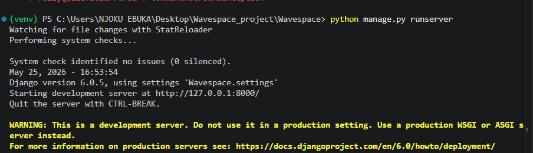

# Wavespace

Wavespace is a Django marketplace project built in small GitHub-friendly batches. The finished app will support buyer and seller accounts, protected listing actions, seller dashboards, and buyer-to-seller messaging.

## Current Batch
Step 1 creates the project foundation:

- Django project package: `wavespace`
- Apps: `accounts` and `marketplace`
- Custom user model with buyer and seller roles
- Shared base template and homepage
- Local virtual environment at `.venv`

## Local Setup

```powershell
.\.venv\Scripts\Activate
pip install django
python manage.py migrate
python manage.py runserver
```

Open `http://127.0.0.1:8000/` in your browser.

## Screenshots

