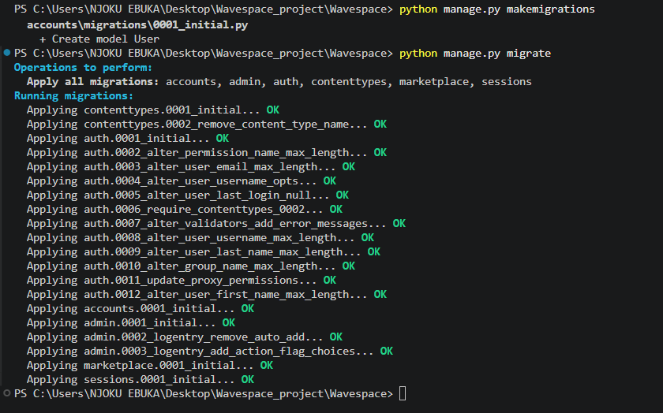
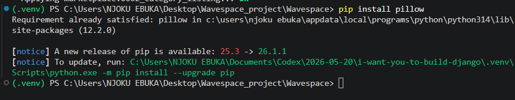
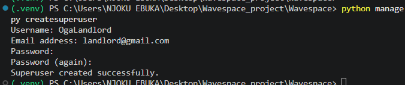

# Wavespace

Wavespace is a Django marketplace project built in small GitHub-friendly batches. The finished app will support buyer and seller accounts, protected listing actions, seller dashboards, and buyer-to-seller messaging.

## Current Batch
Step 1 creates the project foundation:

- Django project package: `wavespace`
- Apps: `accounts` and `marketplace`
- Custom user model with buyer and seller roles
- Shared base template and homepage
- Local virtual environment at `.venv`

## Local Setup

```in powershell```
- install django (pip install django)
- Create a virtual environment (python -m venv venv)
- Actvate it (venv\Scripts\Activate)
- Django project package: django-admnin startproject `wavespace`
- python manage.py makemigrations
- python manage.py migrate
- python manage.py runserver
- pip install pillow
- python manage.py createsuperuser


Open `http://127.0.0.1:8000/` in your browser.

## Screenshots



